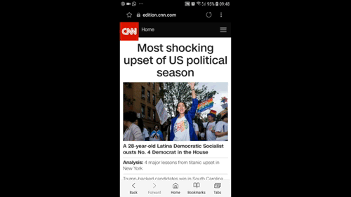

[

# Screenfull React

A React component that implements [screenfull.js](https://github.com/sindresorhus/screenfull.js/).

Screenfull.js allows you to create full screen experiences. I implemented it because I wanted to have that behavior that removes the address bar and navbar on scroll on mobile devices, like you see on sites such as cnn.com. There is another library: screenfull-react, but it wasn't hosted on Github and looking at the source, I didn't like it, so here's the alternative.

This should work fine in SSR environments.

## Usage

### Installation

`npm install screenfull-react`

`yarn add screenfull-react`

### Use

There are two ways to use screenfull-react:

- have it execute on scroll (useful for mobile devices)
- force full screen (useful for popups and other click triggered events)

In other to implement it, just add `<Screenfull />` to your component. 

## Properties

### scrollContainerRef
#### default: null

The container that is used as a reference to detect scrolling. By default this is null and refers to the document.body.

### forceFullScreen
#### default: false

Use <Screenfull forceFullScreen /> to force the full screen without additional interaction. Useful for modals etc.

### mobileOnly 
#### default: true

Only execute full screen on a mobile device. This is currently simply checked based on window width. 

### maxPixelsForMobile 
#### default: 768

The amount of pixels that is considered "mobile".

## FAQ

### The address bar doesn't hide on scroll

Make sure the item you are trying to scroll (by default: `body`) doesn't apply a `overflow: hidden`, `overflow-x: hidden` or `overflow-y: hidden` to it. On some browsers, this leads the scrollTop to always be 0.

Also make sure you apply the Component inside a Component that has a `HTML` (e.g. `div`) tag, not a `React.Fragment`.

## Run examples

Check out the examples directory.

## License

_screenfull-react_ is available under MIT. See LICENSE for more details.
